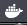

# Terminology

Dotcloud => Docker (Dock Worker)

To build better -> to ship better -> to deploy (run) better

Components of Docker is written in Go or Golang

Open Container Initiative : Standardize container format and runtime , vendor neutral, platform neutral (OCI operates under Linux Foundation)

Containers provide scalable, self healing and portable apps

## Installation

### Ubuntu 16.04

### Install Docker 

* Install Docker

You should see a Docker icon in your task bar in MACOS GUI as shown below

* Check the docker version : :

<pre><code>
dtimuralp-a02:Applications dtimuralp$ <b>docker version</b>
Client: Docker Engine - Community
 Version:           <b>18.09.2</b>
 API version:       1.39
 Go version:        go1.10.8
 Git commit:        6247962
 Built:             Sun Feb 10 04:12:39 2019
 OS/Arch:           darwin/amd64
 Experimental:      false

Server: Docker Engine - Community
 Engine:
  Version:          <b>18.09.2</b>
  API version:      1.39 (minimum version 1.12)
  Go version:       go1.10.6
  Git commit:       6247962
  Built:            Sun Feb 10 04:13:06 2019
  OS/Arch:          linux/amd64
  Experimental:     true
dtimuralp-a02:Applications dtimuralp$
</code></pre>

Docker Client ===== API Calls ===> Docker Server (Daemon) , hence there are two docker versions are shown in this output.

* Check Docker information

<pre><code>
dtimuralp-a02:~ dtimuralp$ <b>docker info</b>
Containers: 6
 Running: 0
 Paused: 0
 Stopped: 6
Images: 6
Server Version: 18.09.2
Storage Driver: overlay2
 Backing Filesystem: extfs
 Supports d_type: true
 Native Overlay Diff: true
Logging Driver: json-file
Cgroup Driver: cgroupfs
Plugins:
 Volume: local
 <b>Network: bridge host ipvlan macvlan null overlay</b>
 Log: awslogs fluentd gcplogs gelf journald json-file local logentries splunk syslog
Swarm: <b>inactive</b>
Runtimes: <b>runc</b> 
Default Runtime: runc
Init Binary: docker-init
containerd version: 9754871865f7fe2f4e74d43e2fc7ccd237edcbce
runc version: 09c8266bf2fcf9519a651b04ae54c967b9ab86ec
init version: fec3683
Security Options:
 seccomp
  Profile: default
Kernel Version: 4.9.125-linuxkit
Operating System: <b>Docker for Mac</b>
OSType: linux
Architecture: x86_64
CPUs: 4
Total Memory: 1.952GiB
Name: linuxkit-025000000001
ID: ADFW:REBN:BHN6:OQ5Z:3OO7:CBDL:YUF7:QAQK:DKR7:RRS3:ITT4:VZVC
Docker Root Dir: /var/lib/docker
Debug Mode (client): false
Debug Mode (server): true
 File Descriptors: 24
 Goroutines: 50
 System Time: 2019-06-17T14:59:43.4842239Z
 EventsListeners: 2
HTTP Proxy: gateway.docker.internal:3128
HTTPS Proxy: gateway.docker.internal:3129
Registry: https://index.docker.io/v1/
Labels:
Experimental: true
Insecure Registries:
 127.0.0.0/8
Live Restore Enabled: false
Product License: Community Engine

dtimuralp-a02:~ dtimuralp$ 
</code></pre>

Docker Swarm shows up as inactive cause I am using a single host.

Runc is Docker' s container runtime which is also donated to the Open Container Project (OCP) . For more info please check [here](https://blog.docker.com/2015/06/runc/)

Docker Operations System is Docker for MAC since I installed it on my MAC.

* Check whether if any containers run by default

<pre><code>
dtimuralp-a02:~ dtimuralp$ <b>docker ps</b>
CONTAINER ID        IMAGE               COMMAND             CREATED             STATUS              PORTS               NAMES
dtimuralp-a02:~ dtimuralp$ 
</code></pre>

Seems like no containers to me.

* Check whether if there is any container images in the local repository

docker images

* Check which Docker networks come by default :

<pre><code>
dtimuralp-a02:~ dtimuralp$ <b>docker network ls>/b>
NETWORK ID          NAME                DRIVER              SCOPE
b5a32321deb2        <b>bridge</b>              <b>bridge</b>              <b>local</b>
7014fee64b30        host                host                local
17f1c5830fc3        none                null                local
dtimuralp-a02:~ dtimuralp$
</code></pre>

Scope "local means, single-host mode. We will focus on the "bridge" for now.

* Inspect the "bridge" config

<pre><code>
dtimuralp-a02:~ dtimuralp$ <b>docker inspect bridge</b>
[
    {
        "Name": "bridge",
        "Id": "b5a32321deb2281ac40e2943c89acc72b2f21cd95db3062b1a9ff01b6e42d730",
        "Created": "2019-06-15T08:17:26.197777261Z",
        "Scope": "local",
        "Driver": "bridge",
        "EnableIPv6": false,
        "IPAM": {
            "Driver": "default",
            "Options": null,
            "Config": [
                {
                    "Subnet": "172.17.0.0/16",
                    "Gateway": "172.17.0.1"
                }
            ]
        },
        "Internal": false,
        "Attachable": false,
        "Ingress": false,
        "ConfigFrom": {
            "Network": ""
        },
        "ConfigOnly": false,
        "Containers": {},
        "Options": {
            "com.docker.network.bridge.default_bridge": "true",
            "com.docker.network.bridge.enable_icc": "true",
            "com.docker.network.bridge.enable_ip_masquerade": "true",
            "com.docker.network.bridge.host_binding_ipv4": "0.0.0.0",
            "com.docker.network.bridge.name": "docker0",
            "com.docker.network.driver.mtu": "1500"
        },
        "Labels": {}
    }
]
dtimuralp-a02:~ dtimuralp$ 
</code></pre>

docker run hello-world (automatically exits the container at the end)

docker ps -a (shows the stopped containers as well)

docker images (or docker images ls)

docker pull ubuntu

docker rm <container-id>

docker rmi <imagename> (or docker rm <image-id>)

docker run -d --name testcontainer -p 80:8080 ubuntu
(-d means detached mode, no need to latch it to the terminal of docker host itself)
(80 is host s port, 8080 is container s port)

docker run -it --name testcontainer ubuntu:latest /bin/bash (To properly exit, without killing the container, ctrl + P + Q)

docker stop $(docker ps -aq)

docker rm $(docker ps -aq)

docker rmi $(docker images -q)

docker login

docker tag bec7434da28d dumlutimuralp/nsxdemo:v1
Note : bec7434da28d is the image id from docker images output

docker push dumlutimuralp/nsxdemo:v1

* Edit an existing container by connecting to it via bash shell and then use below command  :
docker commit container-ID image-name

## ANALOGIES
images can be interpreted as "stopped containers" (like VM Templates)
containers can be interpreted as "running images" (like a VM template turned into an actual VM)

##  RECAP

*docker run : starts a new container (from a referenced image)
*docker pull : copies images to docker host
*docker images : lists images on the docker host
*docker rmi : removes images from the docker host 
*docker ps : lists the running containers
*docker stop : stops running container
*docker rm : removes stopped container

# Networking Basics

docker network 

docker network ls

docker network inspect <name> (or <network-id>)

docker info (shows network plugins)

## Bridge

docker network create -d bridge --subnet 10.0.0.1/24 testbridge

"bridge-utils" package helps us to examine linux bridge features. (need to be installed seperately)

ip link show

docker run -dt --name dumlu1 --network testbridge alpine sleep 1d

docker exec -it dumlu1 sh

docker run -d --name dumlu --network testbridge -p 5000:8080 nigelpoulton/pluralsight-docker-ci

docker port dumlu

# Appendix

Using Symlinks : 
Create = > ln -s /Users/dtimuralp /awesome

Delete = > unlink /awesome
