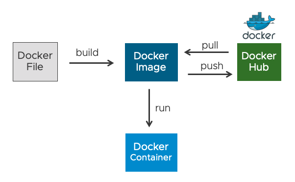
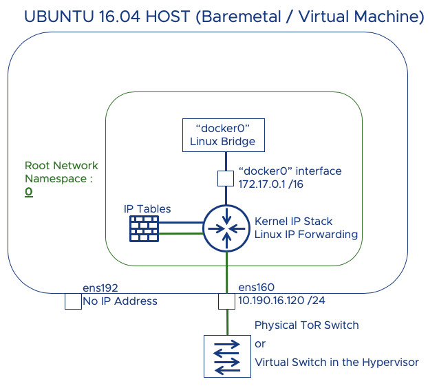
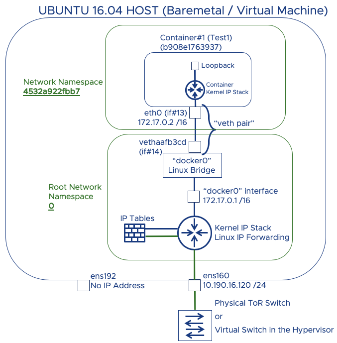
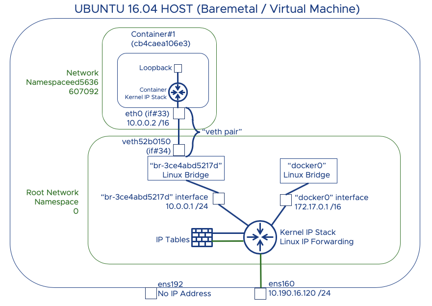

# Docker Networking Intro

This guide provides information about the basic steps on installing Docker Community Edition on Ubuntu 16.04 and how Docker default networking works from a network engineer point of view. There are tons of blog articles on Docker itself. Docker' s website has great amount of information on networking [here](https://docs.docker.com/network/) .

# Table Of Contents

[Background](#Background)   
[Preperation](#Preperation)  
[Installation](#Installation)    
[Docker Basics](#Docker-Basics)    
[Docker Networking](#Docker-Networking)      
[Connectivity](#Connectivity)  
[Linux Bridge](#Linux-Bridge)  
[Creating Containers](#Creating-Containers)  
[Creating a Docker Bridge Network](#Creating-a-Docker-Bridge-Network)  
[CLI Cheatsheet](#CLI-Cheatsheet)  

# Background
[Back to Table of Contents](#Table-Of-Contents)

* Docker is the short version of "Dock Worker"

* The idea is to build better -> to ship better -> to deploy (run) better

* Components of Docker is written in Go or Golang

* Open Container Initiative : Standardize container format and runtime , vendor neutral, platform neutral (OCI operates under Linux Foundation)

* Containers provide scalable, self healing and portable apps

# Preperation
[Back to Table of Contents](#Table-Of-Contents)

A single Ubuntu 16.04.5 LTS based virtual machine is used in this guide. It is configured with a static IP address. As shown below in Ubuntu's shell.

<pre><code>
root@ubuntu26:~# <b>more /etc/network/interfaces</b>
# This file describes the network interfaces available on your system
# and how to activate them. For more information, see interfaces(5).

source /etc/network/interfaces.d/*

auto lo
iface lo inet loopback
auto ens160
iface ens160 inet static
address 10.190.16.120
netmask 255.255.255.0
broadcast 10.190.16.255
gateway 10.190.16.1
dns-nameservers 192.168.1.185
root@ubuntu26:~#
</code></pre>

* Escalate to root

<pre><code>
vmware@ubuntu26:~$ 
vmware@ubuntu26:~$ <b>sudo -H bash</b>
root@ubuntu26:/home/vmware#
</code></pre>

*  Ensure the integrity and authenticity of the images that are downloaded from Docker Hub. GPG is based on Public Key Cryptogragphy (more info is [here](https://www.gnupg.org/))

<pre><code>
root@ubuntu26:/home/vmware#<b>curl -fsSL https://download.docker.com/linux/ubuntu/gpg | sudo apt-key add -</b>
OK
</code></pre>

* Configure Docker Hub as the APT source rather than the Ubuntu 16.04 repository

<pre><code>
root@ubuntu26:/home/vmware# <b>sudo add-apt-repository "deb [arch=amd64] https://download.docker.com/linux/ubuntu $(lsb_release -cs) stable"</b>
root@ubuntu26:/home/vmware#
</code></pre>

* Update Docker packages 

    "apt-get update" basically downloads the package lists from the repositories and "updates" them to get information on the newest versions of packages and their dependencies. 

<pre><code>
root@ubuntu26:/home/vmware# <b>apt-get update</b>
Get:1 http://security.ubuntu.com/ubuntu xenial-security InRelease [109 kB]
Get:2 http://us.archive.ubuntu.com/ubuntu xenial InRelease [247 kB]
|
|
<b>Output Omitted</b>
|
|
Get:48 http://us.archive.ubuntu.com/ubuntu xenial-backports/universe Translation-en [4,184 B]
Fetched 30.0 MB in 9s (3,233 kB/s)
Reading package lists... Done
root@ubuntu26:/home/vmware#
</code></pre>

* Make sure the repository for Docker is Docker repo rather than Ubuntu repo

<pre><code>
root@ubuntu26:/home/vmware# <b>apt-cache policy docker-ce</b>
docker-ce:
  <b>Installed: (none)</b>
  <b>Candidate: 5:18.09.6~3-0~ubuntu-xenial</b>
  Version table:
     5:18.09.6~3-0~ubuntu-xenial 500
        500 https://download.docker.com/linux/ubuntu xenial/stable amd64 Packages
    |
    <b>Output Omitted</b>
    |
     17.03.0~ce-0~ubuntu-xenial 500
        500 https://download.docker.com/linux/ubuntu xenial/stable amd64 Packages
root@ubuntu26:/home/vmware# ^C
</code></pre>

# Installation
[Back to Table of Contents](#Table-Of-Contents)

* Install Docker

<pre><code>
root@ubuntu26:/home/vmware# <b>apt-get install -y docker-ce</b>
Reading package lists... Done
Building dependency tree
Reading state information... Done
The following additional packages will be installed:
  aufs-tools cgroupfs-mount containerd.io docker-ce-cli libltdl7 pigz
Suggested packages:
  mountall
The following NEW packages will be installed:
  aufs-tools cgroupfs-mount containerd.io docker-ce docker-ce-cli libltdl7 pigz
0 upgraded, 7 newly installed, 0 to remove and 161 not upgraded.
Need to get 50.5 MB of archives.
After this operation, 243 MB of additional disk space will be used.
Get:1 http://us.archive.ubuntu.com/ubuntu xenial/universe amd64 pigz amd64 2.3.1-2 [61.1 kB]
Get:2 https://download.docker.com/linux/ubuntu xenial/stable amd64 containerd.io amd64 1.2.5-1 [19.9 MB]
Get:3 http://us.archive.ubuntu.com/ubuntu xenial/universe amd64 aufs-tools amd64 1:3.2+20130722-1.1ubuntu1 [92.9 kB]
Get:4 http://us.archive.ubuntu.com/ubuntu xenial/universe amd64 cgroupfs-mount all 1.2 [4,970 B]
Get:5 http://us.archive.ubuntu.com/ubuntu xenial/main amd64 libltdl7 amd64 2.4.6-0.1 [38.3 kB]
Get:6 https://download.docker.com/linux/ubuntu xenial/stable amd64 docker-ce-cli amd64 5:18.09.6~3-0~ubuntu-xenial [13.0 MB]
Get:7 https://download.docker.com/linux/ubuntu xenial/stable amd64 docker-ce amd64 5:18.09.6~3-0~ubuntu-xenial [17.4 MB]
Fetched 50.5 MB in 10s (4,785 kB/s)
Selecting previously unselected package pigz.
(Reading database ... 59693 files and directories currently installed.)
Preparing to unpack .../pigz_2.3.1-2_amd64.deb ...
|
|
<b>Output Omitted</b>
|
|
Setting up aufs-tools (1:3.2+20130722-1.1ubuntu1) ...
Setting up cgroupfs-mount (1.2) ...
Setting up <b>containerd.io</b> (1.2.5-1) ...
Setting up <b>docker-ce-cli</b> (5:18.09.6~3-0~ubuntu-xenial) ...
Setting up <b>docker-ce</b> (5:18.09.6~3-0~ubuntu-xenial) ...
update-alternatives: using /usr/bin/dockerd-ce to provide /usr/bin/dockerd (dockerd) in auto mode
Setting up libltdl7:amd64 (2.4.6-0.1) ...
Processing triggers for libc-bin (2.23-0ubuntu10) ...
Processing triggers for systemd (229-4ubuntu21.4) ...
Processing triggers for ureadahead (0.100.0-19) ...
root@ubuntu26:/home/vmware#
</code></pre>

* Make sure Docker is running

<pre><code>
root@ubuntu26:/home/vmware# <b>systemctl status docker</b>
● docker.service - Docker Application Container Engine
   Loaded: loaded (/lib/systemd/system/docker.service; enabled; vendor preset: enabled)
   <b>Active: active (running)</b> since Mon 2019-06-17 12:33:25 EDT; 3min 48s ago
     Docs: https://docs.docker.com
 Main PID: 3305 (dockerd)
   CGroup: /system.slice/docker.service
           └─3305 /usr/bin/dockerd -H fd:// --containerd=/run/containerd/containerd.sock

Jun 17 12:33:24 ubuntu26 dockerd[3305]: time="2019-06-17T12:33:24.322015384-04:00" level=warning msg="Your kernel does not support swap memory limit"
Jun 17 12:33:24 ubuntu26 dockerd[3305]: time="2019-06-17T12:33:24.322303782-04:00" level=warning msg="Your kernel does not support cgroup rt period"
Jun 17 12:33:24 ubuntu26 dockerd[3305]: time="2019-06-17T12:33:24.322529745-04:00" level=warning msg="Your kernel does not support cgroup rt runtime"
Jun 17 12:33:24 ubuntu26 dockerd[3305]: time="2019-06-17T12:33:24.323451458-04:00" level=info msg="Loading containers: start."
Jun 17 12:33:24 ubuntu26 dockerd[3305]: time="2019-06-17T12:33:24.867494590-04:00" level=info <b>msg="Default bridge (docker0) is assigned with an IP address 172.17.0.0/16. Daemon option --bip</b>
Jun 17 12:33:24 ubuntu26 dockerd[3305]: time="2019-06-17T12:33:24.944308261-04:00" level=info msg="Loading containers: done."
Jun 17 12:33:25 ubuntu26 dockerd[3305]: time="2019-06-17T12:33:25.012992693-04:00" level=info msg="Docker daemon" commit=481bc77 graphdriver(s)=overlay2 version=18.09.6
Jun 17 12:33:25 ubuntu26 dockerd[3305]: time="2019-06-17T12:33:25.013579127-04:00" level=info msg="Daemon has completed initialization"
Jun 17 12:33:25 ubuntu26 dockerd[3305]: time="2019-06-17T12:33:25.038175853-04:00" level=info msg="API listen on /var/run/docker.sock"
Jun 17 12:33:25 ubuntu26 systemd[1]: <b>Started Docker Application Container Engine.</b>
root@ubuntu26:/home/vmware#
</code></pre>

As you may have already noticed in the output above, a default bridge ("docker0") is created with 172.17.0.0/16 subnet. Details of this bridge will be explained later on. 

The first three error messages are about being able to put memory, CPU and swap limitations to containers. Means that the current Kernel version in Ubuntu 16.04 does not seem to support these features. More info [here](https://support.plesk.com/hc/en-us/articles/115004786934-Docker-service-shows-warnings-Your-kernel-does-not-support-cgroup-rt-runtime) and also [here](https://docs.docker.com/config/containers/resource_constraints/). It is ok as these features will not be used in this lab.

* Check the Docker version

<pre><code>
dtimuralp-a02:Applications dtimuralp$ <b>docker version</b>
root@ubuntu26:/home/vmware# docker version
Client:
 Version:           <b>18.09.6</b>
 API version:       1.39
 Go version:        go1.10.8
 Git commit:        481bc77
 Built:             Sat May  4 02:35:27 2019
 OS/Arch:           linux/amd64
 Experimental:      false

Server: Docker Engine - Community
 Engine:
  Version:          <b>18.09.6</b>
  API version:      1.39 (minimum version 1.12)
  Go version:       go1.10.8
  Git commit:       481bc77
  Built:            Sat May  4 01:59:36 2019
  OS/Arch:          linux/amd64
  Experimental:     false
root@ubuntu26:/home/vmware#
</code></pre>

The logic is Docker Client ===== API Calls ===> Docker Server (Daemon) ; both running on the Ubuntu OS. Hence there are two docker versions are shown in this output, one for client and one for server version.

# Docker Basics
[Back to Table of Contents](#Table-Of-Contents)

* Check Docker information

<pre><code>root@ubuntu26:/home/vmware# <b>docker info</b>
Containers: 0
 Running: 0
 Paused: 0
 Stopped: 0
Images: 0
Server Version: 18.09.6
Storage Driver: overlay2
 Backing Filesystem: extfs
 Supports d_type: true
 Native Overlay Diff: true
Logging Driver: json-file
Cgroup Driver: cgroupfs
Plugins:
 Volume: local
<b>Network: bridge host macvlan null overlay</b>
 Log: awslogs fluentd gcplogs gelf journald json-file local logentries splunk syslog
<b>Swarm: inactive</b>
<b>Runtimes: runc</b>
Default Runtime: runc
Init Binary: docker-init
<b>containerd version</b>: bb71b10fd8f58240ca47fbb579b9d1028eea7c84
runc version: 2b18fe1d885ee5083ef9f0838fee39b62d653e30
init version: fec3683
Security Options:
 apparmor
 seccomp
  Profile: default
Kernel Version: 4.4.0-131-generic
Operating System: Ubuntu 16.04.5 LTS
OSType: linux
Architecture: x86_64
CPUs: 2
Total Memory: 3.859GiB
Name: ubuntu26
ID: 6CX6:X6JC:7QVT:KKOG:ZZO7:35XC:WLVZ:EK3Z:XD7J:CFID:CRNI:7OBA
Docker Root Dir: /var/lib/docker
Debug Mode (client): false
Debug Mode (server): false
Registry: https://index.docker.io/v1/
Labels:
Experimental: false
Insecure Registries:
 127.0.0.0/8
Live Restore Enabled: false
Product License: Community Engine

<b>WARNING: No swap limit support</b>
root@ubuntu26:/home/vmware#
</code></pre>

Docker Swarm shows up as inactive cause I am going to use a single host for now. Swarm is Docker's own container orchestration solution.

**Note for curious ones :** Runc is the runtime container by Docker which is donated to the Open Container Project (OCP) . Containerd is the container runtime wrapper which has runc as a component in it. For more info please check [here](https://blog.docker.com/2015/06/runc/). There is also info about containerd and runc [here](https://blog.docker.com/2017/08/what-is-containerd-runtime/) and [here](https://stackoverflow.com/questions/41645665/how-containerd-compares-to-runc)

* Check whether if any containers run by default

<pre><code>
root@ubuntu26:/home/vmware# <b>docker ps</b>
CONTAINER ID        IMAGE               COMMAND             CREATED             STATUS              PORTS               NAMES
root@ubuntu26:/home/vmware#
</code></pre>

No containers running by default.

* Check whether if there is any container images in the local repository

<pre><code>
root@ubuntu26:/home/vmware# <b>docker images</b>
REPOSITORY          TAG                 IMAGE ID            CREATED             SIZE
root@ubuntu26:/home/vmware#
</code></pre>

No images in the local repository by default.

**Note :** Images can be interpreted as "stopped containers" (like VM Templates). Containers can be interpreted as "running images" (like a VM template turned into an actual VM).

Whenever you' d like to build or run a container you need to find and use a base image. Below figure helps to understand the overall picture.

# Docker Networking
[Back to Table of Contents](#Table-Of-Contents)

Official Docker documentation on "Configuring Networking" can be found [here](https://docs.docker.com/network/) 

Docker has various network drivers .  Most popular ones are Bridge, Overlay and MACVLAN. [This article](https://blog.docker.com/2016/12/understanding-docker-networking-drivers-use-cases/) summarizes them well. In this guide we are focusing on "Bridge" network driver.

* Check which Docker networks are created by default :

<pre><code>
root@ubuntu26:/home/vmware# <b>docker network ls</b>
NETWORK ID          <b>NAME</b>                <b>DRIVER</b>              SCOPE
8dc12dd156a0        <b>bridge</b>              <b>bridge</b>              <b>local</b>
f4238f561257        host                <b>host</b>                local
70c020e17c5e        none                <b>null</b>                local
root@ubuntu26:/home/vmware#
</code></pre>

By default Docker (on Ubuntu OS) creates three networks as shown in the above output. Notice their driver types are bridge, host and none. Scope "local" means, single-host mode. 

What Docker implements with network named as "bridge" is, a Linux bridge named as "docker0" . This will be verified on Ubuntu shell. 

* Inspect the Docker network "bridge" config ("docker network inspect < Docker NETWORK NAME > / OR / < Docker NETWORK ID >)

<pre><code>
root@ubuntu26:/home/vmware# <b>docker network inspect bridge</b>
[
    {
        <b>"Name": "bridge",</b>
        <b>"Id": "8dc12dd156a0</b>8710bd4f6bbb384de6e803d942854b28e84c35f89ee9db75497f",
        "Created": "2019-06-17T12:33:24.867585642-04:00",
        "Scope": "local",
        <b>"Driver": "bridge",</b>
        "EnableIPv6": false,
        <b>"IPAM": {</b>
            "Driver": "default",
            "Options": null,
            "Config": [
                {
                    <b>"Subnet": "172.17.0.0/16"</b>
                }
            ]
        },
        "Internal": false,
        "Attachable": false,
        "Ingress": false,
        "ConfigFrom": {
            "Network": ""
        },
        "ConfigOnly": false,
        "Containers": {},
        "Options": {
            "com.docker.network.bridge.default_bridge": "true",
            "com.docker.network.bridge.<b>enable_icc": "true"</b>,
            "com.docker.network.bridge.<b>enable_ip_masquerade": "true"</b>,
            "com.docker.network.bridge.host_binding_ipv4": "0.0.0.0",
            "com.docker.network.<b>bridge.name": "docker0"</b>,
            "com.docker.network.driver.mtu": "1500"
        },
        "Labels": {}
    }
]
root@ubuntu26:/home/vmware#
</code></pre>

**ID** the first couple of characters in the ID field matches the NETWORK ID shown in "docker network ls" output.

**IPAM => Config => Subnet** is configured as 172.16.0.0/16. Which means, Docker will assign an IP address from this subnet to every container connected to this Docker network.

**enable_icc:true** means that inter container communication is allowed on this Docker network.

**enable_ip_masquerade: true** means that "iptables" rules will be modified on this host to apply SNAT (source NAT) for all the containers connected to this Docker network. Docker manipulates "iptables" rules on the host (Ubuntu virtual machine) to provide network isolation for containers from the external network. IPtables will be explained in a seperate article. More info on this in official Docker documentation is [here](https://docs.docker.com/network/iptables/) 

**bridge name : docker0** Notice that the bridge name is "docker0" . This is the name assigned to the Linux bridge which is configured and managed by Docker.

* Let' s examine the Linux bridge on Ubuntu shell. To do that "bridge-utils" package needs to be installed.

<pre><code>
root@ubuntu26:/home/vmware# <b>apt-get install bridge-utils</b>
Reading package lists... Done
Building dependency tree
Reading state information... Done
The following NEW packages will be installed:
  bridge-utils
0 upgraded, 1 newly installed, 0 to remove and 161 not upgraded.
Need to get 28.6 kB of archives.
After this operation, 102 kB of additional disk space will be used.
Get:1 http://us.archive.ubuntu.com/ubuntu xenial/main amd64 bridge-utils amd64 1.5-9ubuntu1 [28.6 kB]
Fetched 28.6 kB in 0s (31.3 kB/s)
Selecting previously unselected package bridge-utils.
(Reading database ... 59983 files and directories currently installed.)
Preparing to unpack .../bridge-utils_1.5-9ubuntu1_amd64.deb ...
Unpacking bridge-utils (1.5-9ubuntu1) ...
Processing triggers for man-db (2.7.5-1) ...
Setting up bridge-utils (1.5-9ubuntu1) ...
root@ubuntu26:/home/vmware#
</code></pre>

* Let' s check the bridge information from the Linux bridge commands which all start with "brctl"

<pre><code>
root@ubuntu26:/home/vmware# <b>brctl show</b>
bridge name     bridge id               STP enabled     interfaces
<b>docker0</b>         8000.0242ed408e96       <b>no</b>
root@ubuntu26:/home/vmware#
</code></pre>

Remember "docker0" is the name of the Linux bridge. This Linux bridge is being used by the Docker network named as "bridge" ("docker network ls" output)

* Let' s check the link layer state of the interfaces on Ubuntu

<pre><code>
root@ubuntu26:/home/vmware# <b>ip link show</b>
1: lo: <LOOPBACK,UP,LOWER_UP> mtu 65536 qdisc noqueue state UNKNOWN mode DEFAULT group default qlen 1
    link/loopback 00:00:00:00:00:00 brd 00:00:00:00:00:00
2: ens160: <BROADCAST,MULTICAST,UP,LOWER_UP> mtu 1500 qdisc mq state UP mode DEFAULT group default qlen 1000
    link/ether 00:50:56:b4:47:61 brd ff:ff:ff:ff:ff:ff
3: ens192: <BROADCAST,MULTICAST> mtu 1500 qdisc noop state DOWN mode DEFAULT group default qlen 1000
    link/ether 00:50:56:b4:9b:ec brd ff:ff:ff:ff:ff:ff
4: <b>docker0</b>: <NO-CARRIER,BROADCAST,MULTICAST,UP> mtu 1500 qdisc noqueue state <b>DOWN</b> mode DEFAULT group default
    link/ether 02:42:ed:40:8e:96 brd ff:ff:ff:ff:ff:ff
root@ubuntu26:/home/vmware#
</code></pre>

**Notice docker0 interface is down.** 

* Let' s check the network layer state of the interfaces on Ubuntu

<pre><code>
root@ubuntu26:/home/vmware# <b>ip address show</b>
1: lo: <LOOPBACK,UP,LOWER_UP> mtu 65536 qdisc noqueue state UNKNOWN group default qlen 1
    link/loopback 00:00:00:00:00:00 brd 00:00:00:00:00:00
    inet 127.0.0.1/8 scope host lo
       valid_lft forever preferred_lft forever
    inet6 ::1/128 scope host
       valid_lft forever preferred_lft forever
2: <b>ens160</b>: <BROADCAST,MULTICAST,UP,LOWER_UP> mtu 1500 qdisc mq state <b>UP</b> group default qlen 1000
    link/ether 00:50:56:b4:47:61 brd ff:ff:ff:ff:ff:ff
    inet <b>10.190.16.120/24</b> brd 10.190.16.255 scope global ens160
       valid_lft forever preferred_lft forever
    inet6 fe80::250:56ff:feb4:4761/64 scope link
       valid_lft forever preferred_lft forever
3: <b>ens192</b>: <BROADCAST,MULTICAST> mtu 1500 qdisc noop state <b>DOWN</b> group default qlen 1000
    link/ether 00:50:56:b4:9b:ec brd ff:ff:ff:ff:ff:ff
4: <b>docker0</b>: <NO-CARRIER,BROADCAST,MULTICAST,UP> mtu 1500 qdisc noqueue state <b>DOWN</b> group default
    link/ether 02:42:ed:40:8e:96 brd ff:ff:ff:ff:ff:ff
    inet <b>172.17.0.1/16</b> brd 172.17.255.255 scope global docker0
       valid_lft forever preferred_lft forever
    inet6 fe80::42:edff:fe40:8e96/64 scope link
       valid_lft forever preferred_lft forever
root@ubuntu26:/home/vmware#
</code></pre>

ens160 is the first NIC of the Ubuntu OS, ens192 is the second NIC. ens192 is not used in this lab hence it does not have an IP address configured.

* Let' s check the routing table on Ubuntu

<pre><code>
root@ubuntu26:/home/vmware# <b>ip route show</b>
default via 10.190.16.1 dev ens160 onlink
10.190.16.0/24 dev ens160  proto kernel  scope link  src 10.190.16.120
172.17.0.0/16 dev docker0  proto kernel  scope link  src 172.17.0.1 <b>linkdown</b>
root@ubuntu26:/home/vmware#
</code></pre>

# Connectivity
[Back to Table of Contents](#Table-Of-Contents)

At this stage, the connectivity diagram in the Ubuntu host is shown below.

There is a new term mentioned in this diagram, "network namespace". The easiest analogy to use for network namespace is VRF (Virtual Routing Forwarding) instances on an ordinary router in the routing & switching world. Although there are a few slight differences in between, in Linux, network namespaces are used for isolating network domains from each other. [Here](https://docs.openstack.org/neutron/pike/admin/intro-network-namespaces.html) is a good definition of it. [This is](https://blogs.igalia.com/dpino/2016/04/10/network-namespaces/) a good blog article on practical usage. Network namespaces become relevant in the case of containers and it will be explained in the next section.

The way root network namespace id can be identified is by using the ip netns list-id command shown below.

<pre><code>
root@ubuntu26:/home/vmware# <b>ip netns list-id</b>
nsid <b>0</b>
root@ubuntu26:/home/vmware#
</code></pre>

# Linux Bridge
[Back to Table of Contents](#Table-Of-Contents)

As mentioned a few times already, when Docker is installed, what Docker actually does is creating a Linux bridge named as "docker0". This also creates a new interface in Linux IP stack. This is native Linux bridge logic. Nothing specific. All Docker does is using Linux networking features at the backend.

In fact all this can easily be tested by manually creating a test Linux bridge and by verifying as shown below. 

* Create a Linux test bridge

<pre><code>
root@ubuntu26:/home/vmware# <b>brctl addbr testbridge</b>
root@ubuntu26:/home/vmware# <b>brctl show</b>
bridge name     bridge id               STP enabled     interfaces
docker0         8000.0242ed408e96       no              
<b>testbridge</b>              8000.000000000000       no
</code></pre>

* Verify the new interface in Linux IP stack

<pre><code>
root@ubuntu26:/home/vmware# <b>ip link show</b>
1: lo: <LOOPBACK,UP,LOWER_UP> mtu 65536 qdisc noqueue state UNKNOWN mode DEFAULT group default qlen 1
    link/loopback 00:00:00:00:00:00 brd 00:00:00:00:00:00
2: ens160: <BROADCAST,MULTICAST,UP,LOWER_UP> mtu 1500 qdisc mq state UP mode DEFAULT group default qlen 1000
    link/ether 00:50:56:b4:47:61 brd ff:ff:ff:ff:ff:ff
3: ens192: <BROADCAST,MULTICAST> mtu 1500 qdisc noop state DOWN mode DEFAULT group default qlen 1000
    link/ether 00:50:56:b4:9b:ec brd ff:ff:ff:ff:ff:ff
4: docker0: <BROADCAST,MULTICAST,UP,LOWER_UP> mtu 1500 qdisc noqueue state DOWN mode DEFAULT group default
    link/ether 02:42:ed:40:8e:96 brd ff:ff:ff:ff:ff:ff
5: <b>testbridge</b>: <BROADCAST,MULTICAST> mtu 1500 qdisc noop state DOWN mode DEFAULT group default qlen 1000
    link/ether 62:bc:ca:07:1d:37 brd ff:ff:ff:ff:ff:ff
</code></pre>

* Assign an IP address to the interface

<pre><code>
root@ubuntu26:/home/vmware# <b>ip addr add 10.10.10.1/24 dev testbridge</b>
</code></pre>

<pre><code>
root@ubuntu26:/home/vmware# <b>ip address show</b>
1: lo: <LOOPBACK,UP,LOWER_UP> mtu 65536 qdisc noqueue state UNKNOWN group default qlen 1
    link/loopback 00:00:00:00:00:00 brd 00:00:00:00:00:00
    inet 127.0.0.1/8 scope host lo
       valid_lft forever preferred_lft forever
    inet6 ::1/128 scope host
       valid_lft forever preferred_lft forever
2: ens160: <BROADCAST,MULTICAST,UP,LOWER_UP> mtu 1500 qdisc mq state UP group default qlen 1000
    link/ether 00:50:56:b4:47:61 brd ff:ff:ff:ff:ff:ff
    inet 10.190.16.120/24 brd 10.190.16.255 scope global ens160
       valid_lft forever preferred_lft forever
    inet6 fe80::250:56ff:feb4:4761/64 scope link
       valid_lft forever preferred_lft forever
3: ens192: <BROADCAST,MULTICAST> mtu 1500 qdisc noop state DOWN group default qlen 1000
    link/ether 00:50:56:b4:9b:ec brd ff:ff:ff:ff:ff:ff
4: docker0: <BROADCAST,MULTICAST,UP,LOWER_UP> mtu 1500 qdisc noqueue state DOWN group default
    link/ether 02:42:ed:40:8e:96 brd ff:ff:ff:ff:ff:ff
    inet 172.17.0.1/16 brd 172.17.255.255 scope global docker0
       valid_lft forever preferred_lft forever
    inet6 fe80::42:edff:fe40:8e96/64 scope link
       valid_lft forever preferred_lft forever
5: <b>testbridge</b>: <BROADCAST,MULTICAST> mtu 1500 qdisc noop state DOWN group default qlen 1000
    link/ether 62:bc:ca:07:1d:37 brd ff:ff:ff:ff:ff:ff
    inet <b>10.10.10.1/24</b> scope global testbridge
       valid_lft forever preferred_lft forever
</code></pre>

* Delete the Linux test bridge 

<pre><code>
root@ubuntu26:/home/vmware# <b>brctl delbr testbridge</b>
root@ubuntu26:/home/vmware# <b>brctl show</b>
bridge name     bridge id               STP enabled     interfaces
docker0         8000.0242ed408e96       no              
</code></pre>

# Creating containers
[Back to Table of Contents](#Table-Of-Contents)

Docker uses various Linux namespace technologies for isolation. (ie user namespace, process namespace, etc.) For networking, it uses Linux network namespaces. Each container runs in its own Linux network namespace which means it has its own IP address, routing table, etc.  Docker creates the content related to each network namespace here on Ubuntu => **_/var/run/docker/netns/_**  

**Note :** This is different than checking network namespaces that are created directly through Linux  (which can be investigated by "**ip netns list**" command. Something I learned the hardway.) Cause Docker created network namespaces are under the specific Docker folder mentioned above. [This thread](https://stackoverflow.com/questions/31265993/docker-networking-namespace-not-visible-in-ip-netns-list) explains the whole details quite well.  

* Let' s create a container and see how docker0 bridge, interface connections and other things change

<pre><code>
root@ubuntu26:/home/vmware# <b>docker run -d --name test1 dumlutimuralp/networktest</b>
Unable to find image 'dumlutimuralp/networktest:latest' locally
latest: Pulling from dumlutimuralp/networktest
357ea8c3d80b: Pull complete
|
|
<b>Output Omitted</b>
|
|
74525030d7c5: Pull complete
Digest: sha256:9e1ab3bffe246ec101e6a3cefa012c480035b5518225b108e47faa424d062ca3
Status: Downloaded newer image for dumlutimuralp/networktest:latest
b908e176393711f48e6e425526b2858e428711ce364ada295be9b769739ddfa2
</code></pre>

**"docker run"** is the Docker command to pull a Docker image and then run it with the parameters provided. 

**"-d"** means run this container in detached mode so that it can run in the background (not foreground, aka the terminal, which runs the shell) More info [here](https://docs.docker.com/engine/reference/run/#detached-vs-foreground) and [here](https://subscription.packtpub.com/book/networking_and_servers/9781784392826/6/ch06lvl1sec61/running-a-container-in-detached-mode)

**--name** is used to assign a name to this container, "Test1" is given as the container name in this example

**dumlutimuralp/networktest** is the location and the name of the Docker image to be used to create the container from (Since this image does not exist locally, Docker pulls the image from Docker Hub. I have a repository in Docker hub and the Docker image name is networktest)

* Let' s check the status of the container

<pre><code>
root@ubuntu26:/home/vmware# <b>docker ps</b>
CONTAINER ID        IMAGE                       COMMAND                  CREATED             STATUS              PORTS               NAMES
<b>b908e1763937</b>        dumlutimuralp/networktest   "/docker-entrypoint.…"   <b>10 seconds ago</b>      Up 8 seconds        80/tcp, 443/tcp     <b>test1</b>
</code></pre>

* Let' s check what has changed on the Linux bridge

<pre><code>
root@ubuntu26:/home/vmware# <b>brctl show</b>
bridge name     bridge id               STP enabled     interfaces
<b>docker0</b>         8000.0242ed408e96       no              <b>vethaafb3cd</b>
root@ubuntu26:/home/vmware#
</code></pre>

Nice. We got a new interface attached to the bridge. **(vethaafb3cd)** Notice that when creating the container in the previous step we did not specify any specific Docker network to connect the container to. Docker network "bridge" is selected by default. 

* Let' s check how the IP interfaces have changed on Ubuntu

<pre><code>
root@ubuntu26:/home/vmware# <b>ip link show</b>
1: lo: <LOOPBACK,UP,LOWER_UP> mtu 65536 qdisc noqueue state UNKNOWN mode DEFAULT group default qlen 1
    link/loopback 00:00:00:00:00:00 brd 00:00:00:00:00:00
2: ens160: <BROADCAST,MULTICAST,UP,LOWER_UP> mtu 1500 qdisc mq state UP mode DEFAULT group default qlen 1000
    link/ether 00:50:56:b4:47:61 brd ff:ff:ff:ff:ff:ff
3: ens192: <BROADCAST,MULTICAST> mtu 1500 qdisc noop state DOWN mode DEFAULT group default qlen 1000
    link/ether 00:50:56:b4:9b:ec brd ff:ff:ff:ff:ff:ff
4: docker0: <BROADCAST,MULTICAST,UP,LOWER_UP> mtu 1500 qdisc noqueue <b>state UP</b> mode DEFAULT group default
    link/ether 02:42:ed:40:8e:96 brd ff:ff:ff:ff:ff:ff
14: <b>vethaafb3cd@if13</b>: <BROADCAST,MULTICAST,UP,LOWER_UP> mtu 1500 qdisc noqueue <b>master docker0 state UP</b> mode DEFAULT group default
    link/ether a2:cf:f6:c2:96:79 brd ff:ff:ff:ff:ff:ff <b>link-netnsid 0</b>
root@ubuntu26:/home/vmware#
</code></pre>

A few  interesting things in the above output :  

The **docker0 interface** has now changed its state to **"UP"**. 

**"vethaafb3cd"** interface shows up in IP interface output of the Ubuntu host and its index is **#14** and this "vethaafb3cd" interface has an expression **"if13"** at the end. The master for this **"vethaafb3cd"** interface seems to be **"docker0"**. The other thing is there is an expression at the end **"link-netnsid 0"**.  

* Let' s check the current network namespace list on Ubuntu 

<pre><code>
root@ubuntu26:/home/vmware# <b>ls /var/run/docker/netns</b>
<b>4532a922fbb7</b>
root@ubuntu26:/home/vmware#
</code></pre>

Hmmm..There is a new network namespace. Could it be the one that the recently created container is in ? 

* Let' s inspect the container that we just created

<pre><code>
root@ubuntu26:/home/vmware# <b>docker ps</b>
CONTAINER ID        IMAGE                       COMMAND                  CREATED             STATUS              PORTS               NAMES
<b>b908e1763937</b>        dumlutimuralp/networktest   "/docker-entrypoint.…"   About an hour ago   Up About an hour    80/tcp, 443/tcp     test1
root@ubuntu26:/home/vmware#
root@ubuntu26:/home/vmware#
root@ubuntu26:/home/vmware# <b>docker inspect b908e1763937</b>
[
    {
        "Id": "b908e176393711f48e6e425526b2858e428711ce364ada295be9b769739ddfa2",
        "Created": "2019-06-18T12:39:59.599260556Z",
        "Path": "/docker-entrypoint.sh",
        "Args": [],
        "State": {
            "Status": "running",
            "Running": true,
            "Paused": false,
            "Restarting": false,
            "OOMKilled": false,
            "Dead": false,
            "Pid": 6861,
            "ExitCode": 0,
            "Error": "",
            "StartedAt": "2019-06-18T12:40:01.033430219Z",
            "FinishedAt": "0001-01-01T00:00:00Z"
        },
        "Image": "sha256:f06aa1d7d63a447137e7f8aa41945a707659afc5c531e639672e3477cb300499",
        "ResolvConfPath": "/var/lib/docker/containers/b908e176393711f48e6e425526b2858e428711ce364ada295be9b769739ddfa2/resolv.conf",
        "HostnamePath": "/var/lib/docker/containers/b908e176393711f48e6e425526b2858e428711ce364ada295be9b769739ddfa2/hostname",
        "HostsPath": "/var/lib/docker/containers/b908e176393711f48e6e425526b2858e428711ce364ada295be9b769739ddfa2/hosts",
        "LogPath": "/var/lib/docker/containers/b908e176393711f48e6e425526b2858e428711ce364ada295be9b769739ddfa2/b908e176393711f48e6e425526b2858e428711ce364ada295be9b769739ddfa2-json.log",
        "Name": "/test1",
       |
       |
       |
       <b>Output Omitted</b>
       |
       |
       |
        "NetworkSettings": {
            <b>"Bridge": "",</b>
            "SandboxID": "4532a922fbb7ca920b42d7ce99c3b78d12cecfa4c53ff6b631f02b2722ac288b",
            "HairpinMode": false,
            "LinkLocalIPv6Address": "",
            "LinkLocalIPv6PrefixLen": 0,
            "Ports": {
                "443/tcp": null,
                "80/tcp": null
            },
            <b>"SandboxKey": "/var/run/docker/netns/4532a922fbb7",</b>
            "SecondaryIPAddresses": null,
            "SecondaryIPv6Addresses": null,
            "EndpointID": "1b12b1e5001cc0d33c9e6c2083599519b7c4c75d2364946f1d3fe25c4b7bca33",
            <b>"Gateway": "172.17.0.1",</b>
            "GlobalIPv6Address": "",
            "GlobalIPv6PrefixLen": 0,
            <b>"IPAddress": "172.17.0.2",</b>
            <b>"IPPrefixLen": 16,</b>
            "IPv6Gateway": "",
            <b>"MacAddress": "02:42:ac:11:00:02",</b>
            "Networks": {
                "bridge": {
                    "IPAMConfig": null,
                    "Links": null,
                    "Aliases": null,
                    "NetworkID": "8dc12dd156a08710bd4f6bbb384de6e803d942854b28e84c35f89ee9db75497f",
                    "EndpointID": "1b12b1e5001cc0d33c9e6c2083599519b7c4c75d2364946f1d3fe25c4b7bca33",
                    "Gateway": "172.17.0.1",
                    "IPAddress": "172.17.0.2",
                    "IPPrefixLen": 16,
                    "IPv6Gateway": "",
                    "GlobalIPv6Address": "",
                    "GlobalIPv6PrefixLen": 0,
                    "MacAddress": "02:42:ac:11:00:02",
                    "DriverOpts": null
                }
            }
        }
    }
]
root@ubuntu26:/home/vmware#
</code></pre>

So based on the output above, the container has an IP address of **"172.17.0.2"** , its network namespace is created with an ID of **"4532a922fbb7"** . 

* Let' s check the IP interfaces in the container's network namespace. We can do this this from Ubuntu shell as shown below

<pre><code>
root@ubuntu26:/home/vmware# <b>nsenter --net=/var/run/docker/netns/4532a922fbb7 ip address show</b>
<b>1: lo</b>: <LOOPBACK,UP,LOWER_UP> mtu 65536 qdisc noqueue state UNKNOWN group default qlen 1
    link/loopback 00:00:00:00:00:00 brd 00:00:00:00:00:00
    inet <b>127.0.0.1/8</b> scope host lo
       valid_lft forever preferred_lft forever
<b>13: eth0@if14</b>: <BROADCAST,MULTICAST,UP,LOWER_UP> mtu 1500 qdisc noqueue state UP group default
    link/ether 02:42:ac:11:00:02 brd ff:ff:ff:ff:ff:ff <b>link-netnsid 0</b>
    inet <b>172.17.0.2/16</b> brd 172.17.255.255 scope global eth0
       valid_lft forever preferred_lft forever
root@ubuntu26:/home/vmware#
</code></pre>

In the above output, <b>#13</b> is the interface ID in the container itself, <b>#14</b> is the interface ID on the other end; and that other end is Ubuntu host itself. 

**The connection between eth0 (Interface ID#13) in root network namespace (netnsid : 0)  and vethaafb3cd (Interface ID#14) in container network namespace (netnsid :4532a922fbb7) is called "veth Pair".**

**A container gets connected to the root network namespace through a connection called "veth pair" and the container has its own network namespace.**

* Let' s check the IP route table in the container' s network namespace. 

<pre><code>
root@ubuntu26:/home/vmware# <b>nsenter --net=/var/run/docker/netns/4532a922fbb7 ip route show</b>
<b>default via 172.17.0.1 dev eth0</b>
172.17.0.0/16 dev eth0 proto kernel scope link src 172.17.0.2
</code></pre>

* There is another way to verify this, which is more or less brings the same output in the previous step, but directly from the container network namespace itself

<pre><code>
root@ubuntu26:/home/vmware# <b>docker exec -it b908e1763937 bash</b>
<b>bash-4.4# ip address show</b>
1: lo: <LOOPBACK,UP,LOWER_UP> mtu 65536 qdisc noqueue state UNKNOWN group default qlen 1
    link/loopback 00:00:00:00:00:00 brd 00:00:00:00:00:00
    inet 127.0.0.1/8 scope host lo
       valid_lft forever preferred_lft forever
13: eth0@if14: <BROADCAST,MULTICAST,UP,LOWER_UP> mtu 1500 qdisc noqueue state UP group default
    link/ether 02:42:ac:11:00:02 brd ff:ff:ff:ff:ff:ff link-netnsid 0
    inet 172.17.0.2/16 brd 172.17.255.255 scope global eth0
       valid_lft forever preferred_lft forever
<b>bash-4.4#ip route show</b>
<b>default via 172.17.0.1 dev eth0</b>
172.17.0.0/16 dev eth0 proto kernel scope link src 172.17.0.2
</code></pre>

In the above command  

**"-t"** is for connecting to the terminal inside that container
**"-i"** stands for interactive, since we are using the shell for executing the commands in the container itself

* Below is the current connectivity

* Let' s inspect the default Docker network "bridge"

<pre><code>
root@ubuntu26:/home/vmware# <b>docker network inspect bridge</b>
[
    {
        "Name": "bridge",
        "Id": "8dc12dd156a08710bd4f6bbb384de6e803d942854b28e84c35f89ee9db75497f",
        "Created": "2019-06-17T12:33:24.867585642-04:00",
        "Scope": "local",
        "Driver": "bridge",
        "EnableIPv6": false,
        "IPAM": {
            "Driver": "default",
            "Options": null,
            "Config": [
                {
                    "Subnet": "172.17.0.0/16"
                }
            ]
        },
        "Internal": false,
        "Attachable": false,
        "Ingress": false,
        "ConfigFrom": {
            "Network": ""
        },
        "ConfigOnly": false,
        <b>"Containers": {
            "b908e176393711f48e6e425526b2858e428711ce364ada295be9b769739ddfa2": {
                "Name": "test1",
                "EndpointID": "1b12b1e5001cc0d33c9e6c2083599519b7c4c75d2364946f1d3fe25c4b7bca33",
                "MacAddress": "02:42:ac:11:00:02",
                "IPv4Address": "172.17.0.2/16",
                "IPv6Address": ""
            }
        },</b>
        "Options": {
            "com.docker.network.bridge.default_bridge": "true",
            "com.docker.network.bridge.enable_icc": "true",
            "com.docker.network.bridge.enable_ip_masquerade": "true",
            "com.docker.network.bridge.host_binding_ipv4": "0.0.0.0",
            "com.docker.network.bridge.name": "docker0",
            "com.docker.network.driver.mtu": "1500"
        },
        "Labels": {}
    }
]
root@ubuntu26:/home/vmware#
</code></pre>

Notice that the "Containers" section in the output above is now populated with the "Test1" container' s information.

* Let' s create another container from the same Docker image

<pre><code>
root@ubuntu26:/home/vmware# <b>docker run -d --name test2 dumlutimuralp/networktest</b>
b194dcfda013843fa5752715cc188ab21af8dca3939210675145dbc55ce67f7e
root@ubuntu26:/home/vmware# <b>docker ps</b>
CONTAINER ID        IMAGE                       COMMAND                  CREATED             STATUS              PORTS               NAMES
<b>b194dcfda013</b>        dumlutimuralp/networktest   "/docker-entrypoint.…"   11 seconds ago      Up 8 seconds        80/tcp, 443/tcp     test2
b908e1763937        dumlutimuralp/networktest   "/docker-entrypoint.…"   10 minutes ago      Up 10 minutes       80/tcp, 443/tcp     test1
root@ubuntu26:/home/vmware#
</code></pre>

* Let' s check the network namespaces on Ubuntu

<pre><code>
root@ubuntu26:/home/vmware# <b>ls /var/run/docker/netns</b>
<b>68372b922ca7</b>
4532a922fbb7
root@ubuntu26:/home/vmware#
</code></pre>

Notice that there is a new network namespace created since we have created the second container.

* Let' s inspect the Docker network "bridge" once again 

<pre><code>
root@ubuntu26:/home/vmware# docker network inspect bridge
[
    {
        "Name": "bridge",
        "Id": "8dc12dd156a08710bd4f6bbb384de6e803d942854b28e84c35f89ee9db75497f",
        "Created": "2019-06-17T12:33:24.867585642-04:00",
        "Scope": "local",
        "Driver": "bridge",
        "EnableIPv6": false,
        "IPAM": {
            "Driver": "default",
            "Options": null,
            "Config": [
                {
                    "Subnet": "172.17.0.0/16"
                }
            ]
        },
        "Internal": false,
        "Attachable": false,
        "Ingress": false,
        "ConfigFrom": {
            "Network": ""
        },
        "ConfigOnly": false,
        "Containers": {
            <b>"b194dcfda013843fa5752715cc188ab21af8dca3939210675145dbc55ce67f7e": {
                "Name": "test2",
                "EndpointID": "9e682ad8687c1b15f149f0c0e14ed8f36b10022fe335d27b1b774f13daf1de0a",
                "MacAddress": "02:42:ac:11:00:03",
                "IPv4Address": "172.17.0.3/16",
                "IPv6Address": ""
            },</b>
            "b908e176393711f48e6e425526b2858e428711ce364ada295be9b769739ddfa2": {
                "Name": "test1",
                "EndpointID": "1b12b1e5001cc0d33c9e6c2083599519b7c4c75d2364946f1d3fe25c4b7bca33",
                "MacAddress": "02:42:ac:11:00:02",
                "IPv4Address": "172.17.0.2/16",
                "IPv6Address": ""
            }
        },
        "Options": {
            "com.docker.network.bridge.default_bridge": "true",
            "com.docker.network.bridge.enable_icc": "true",
            "com.docker.network.bridge.enable_ip_masquerade": "true",
            "com.docker.network.bridge.host_binding_ipv4": "0.0.0.0",
            "com.docker.network.bridge.name": "docker0",
            "com.docker.network.driver.mtu": "1500"
        },
        "Labels": {}
    }
]
root@ubuntu26:/home/vmware#
</code></pre>

There are two entries in "Containers" section, shown above.

* The current connectivity looks like below 

* Let' s check inter container connectivity (Test1 Container -> Test 2 Container ICMP traffic)

<pre><code>
root@ubuntu26:/home/vmware# <b>docker exec -it b908e1763937 bash</b>
bash-4.4# ping 172.17.0.3
PING 172.17.0.3 (172.17.0.3) 56(84) bytes of data.
64 bytes from 172.17.0.3: icmp_seq=1 ttl=64 time=4.63 ms
64 bytes from 172.17.0.3: icmp_seq=2 ttl=64 time=0.076 ms
64 bytes from 172.17.0.3: icmp_seq=3 ttl=64 time=0.088 ms
64 bytes from 172.17.0.3: icmp_seq=4 ttl=64 time=0.085 ms
64 bytes from 172.17.0.3: icmp_seq=5 ttl=64 time=0.072 ms
64 bytes from 172.17.0.3: icmp_seq=6 ttl=64 time=0.070 ms
^C
--- 172.17.0.3 ping statistics ---
6 packets transmitted, 6 received, 0% packet loss, time 5000ms
rtt min/avg/max/mdev = 0.070/0.837/4.634/1.698 ms
bash-4.4#<b>exit</b>
root@ubuntu26:/home/vmware# 
</code></pre>

* Let' s delete the containers

<pre><code>
root@ubuntu26:/home/vmware# <b>docker ps</b>
CONTAINER ID        IMAGE                       COMMAND                  CREATED             STATUS              PORTS               NAMES
b194dcfda013        dumlutimuralp/networktest   "/docker-entrypoint.…"   2 minutes ago       Up 82 minutes       80/tcp, 443/tcp     test2
b908e1763937        dumlutimuralp/networktest   "/docker-entrypoint.…"   20 minutes ago      Up 20 minutes       80/tcp, 443/tcp     test1
root@ubuntu26:/home/vmware#
</code></pre>

<pre><code>
root@ubuntu26:/home/vmware# <b>docker rm b194dcfda013</b>
Error response from daemon: You cannot remove a running container b194dcfda013843fa5752715cc188ab21af8dca3939210675145dbc55ce67f7e. Stop the container before attempting removal or force remove
root@ubuntu26:/home/vmware#
</code></pre>

As you can see above you can not delete a container without stopping it.

<pre><code>
root@ubuntu26:/home/vmware# <b>docker stop b194dcfda013</b>
docker stop b908e1763937b194dcfda013
root@ubuntu26:/home/vmware# <b>docker stop b908e1763937</b>
docker rm b194dcfda013b908e1763937
root@ubuntu26:/home/vmware# <b>docker rm b194dcfda013</b>
b194dcfda013
root@ubuntu26:/home/vmware# <b>docker rm b908e1763937</b>
b908e1763937
root@ubuntu26:/home/vmware# <b>docker ps</b>
CONTAINER ID        IMAGE               COMMAND             CREATED             STATUS              PORTS               NAMES
root@ubuntu26:/home/vmware#
</code></pre>

# Creating a Docker Bridge Network
[Back to Table of Contents](#Table-Of-Contents)

* Let' s create a new Docker network (using bridge driver)

<pre><code>
root@ubuntu26:/home/vmware# <b>docker network create -d bridge --subnet 10.0.0.1/24 testbridge</b>
<b>3ce4abd5217ddbdc682ebc3e59b364f900419308c902322ed422549546675502</b>
root@ubuntu26:/home/vmware#
</code></pre>

**"-d"** specifies the driver type for the network. command has created a new bridge named as "testbridge" with subnet 10.0.0.0/24. **"docker network create --help"** can be used to gather information about the command usage.

* Let' s check the Docker network list again

<pre><code>
root@ubuntu26:/home/vmware# <b>docker network ls</b>
NETWORK ID          NAME                DRIVER              SCOPE
8dc12dd156a0        bridge              bridge              local
f4238f561257        host                host                local
70c020e17c5e        none                null                local
<b>3ce4abd5217d</b>        <b>testbridge</b>          <b>bridge</b>              local
</code></pre>

* Let' s check the Linux bridge output

<pre><code>
root@ubuntu26:/home/vmware# <b>brctl show</b>
bridge name     bridge id               STP enabled     interfaces
<b>br-3ce4abd5217d</b> 8000.0242b997f9f8       no
docker0         8000.0242ed408e96       no
root@ubuntu26:/home/vmware#
</code></pre>

In the above output the new Linux bridge created as a result of this new Docker network is highlighted. Notice that the ID that comes after "br-" string is the NETWORK ID that is shown in the "docker network ls" output previously.

* Let' s check the IP interfaces on Ubuntu

<pre><code>
root@ubuntu26:/home/vmware# <b>ip address show</b>
1: lo: <LOOPBACK,UP,LOWER_UP> mtu 65536 qdisc noqueue state UNKNOWN group default qlen 1
    link/loopback 00:00:00:00:00:00 brd 00:00:00:00:00:00
    inet 127.0.0.1/8 scope host lo
       valid_lft forever preferred_lft forever
    inet6 ::1/128 scope host
       valid_lft forever preferred_lft forever
2: ens160: <BROADCAST,MULTICAST,UP,LOWER_UP> mtu 1500 qdisc mq state UP group default qlen 1000
    link/ether 00:50:56:b4:47:61 brd ff:ff:ff:ff:ff:ff
    inet 10.190.16.120/24 brd 10.190.16.255 scope global ens160
       valid_lft forever preferred_lft forever
    inet6 fe80::250:56ff:feb4:4761/64 scope link
       valid_lft forever preferred_lft forever
3: ens192: <BROADCAST,MULTICAST> mtu 1500 qdisc noop state DOWN group default qlen 1000
    link/ether 00:50:56:b4:9b:ec brd ff:ff:ff:ff:ff:ff
4: docker0: <NO-CARRIER,BROADCAST,MULTICAST,UP> mtu 1500 qdisc noqueue state DOWN group default
    link/ether 02:42:ed:40:8e:96 brd ff:ff:ff:ff:ff:ff
    inet 172.17.0.1/16 brd 172.17.255.255 scope global docker0
       valid_lft forever preferred_lft forever
    inet6 fe80::42:edff:fe40:8e96/64 scope link
       valid_lft forever preferred_lft forever
26: <b>br-3ce4abd5217d</b>: <NO-CARRIER,BROADCAST,MULTICAST,UP> mtu 1500 qdisc noqueue state <b>DOWN</b> group default
    link/ether 02:42:b9:97:f9:f8 brd ff:ff:ff:ff:ff:ff
    inet <b>10.0.0.1/24</b> brd 10.0.0.255 scope global br-3ce4abd5217d
       valid_lft forever preferred_lft forever
    inet6 fe80::42:b9ff:fe97:f9f8/64 scope link
       valid_lft forever preferred_lft forever
root@ubuntu26:/home/vmware#
</code></pre>

As shown above the newly created "br-3ce4abd5217d" s state is down. 

* Let' s examine this new bridge network ("docker network inspect < Docker NETWORK NAME > / OR / < Docker NETWORK ID >)

<pre><code>
root@ubuntu26:/home/vmware# <b>docker network inspect testbridge</b>
[
    {
        <b>"Name": "testbridge",</b>
        "Id": "<b>3ce4abd5217d</b>dbdc682ebc3e59b364f900419308c902322ed422549546675502",
        "Created": "2019-06-26T09:10:39.669511746-04:00",
        "Scope": "local",
        <b>"Driver": "bridge",</b>
        "EnableIPv6": false,
        <b>"IPAM": {</b>
            "Driver": "default",
            "Options": {},
            "Config": [
                {
                    <b>"Subnet": "10.0.0.1/24"</b>
                }
            ]
        },
        "Internal": false,
        "Attachable": false,
        "Ingress": false,
        "ConfigFrom": {
            "Network": ""
        },
        "ConfigOnly": false,
        "Containers": {},
        "Options": {},
        "Labels": {}
    }
]
root@ubuntu26:/home/vmware#
</code></pre>

* Let's create a container in this bridge network

<pre><code>
root@ubuntu26:/home/vmware# <b>docker run -d --name container1 --network testbridge dumlutimuralp/networktest</b>
<b>cb4caea106e3e7799a65fef53343f7747d11960c98ce947c73a0f20bd828cf40</b>
root@ubuntu26:/home/vmware#
</code></pre>

* Let' s check the network namespace of the container 

<pre><code>
root@ubuntu26:/home/vmware# <b>docker ps</b>
CONTAINER ID        IMAGE                       COMMAND                  CREATED             STATUS              PORTS               NAMES
<b>cb4caea106e3</b>        dumlutimuralp/networktest   "/docker-entrypoint.…"   6 minutes ago       Up 6 minutes        80/tcp, 443/tcp     container1
root@ubuntu26:/home/vmware# docker inspect cb4caea106e3 | box
root@ubuntu26:/home/vmware# docker inspect cb4caea106e3 | grep Sandbox
            "SandboxID": "ed5636607092c584adbb7231032a1a4b438a160b2d7ae979d7d5160efc726a76",
            "SandboxKey": "<b>/var/run/docker/netns/ed5636607092</b>",
root@ubuntu26:/home/vmware#
</code></pre>

Above you can see the network namespace <ed5636607092> created for this container. 

As shown in the previous section, the network namespace list of the Ubuntu host can be queried as below, and it is expected to see that the network namespace ID in below output should match the one that is shown in the above output.

<pre><code>
root@ubuntu26:/home/vmware# <b>ls /var/run/docker/netns/</b>
<b>ed5636607092</b>
root@ubuntu26:/home/vmware#
</code></pre>

* Let' s check the IP interfaces in the container

<pre><code>
root@ubuntu26:/home/vmware# <b>nsenter --net=/var/run/docker/netns/ed5636607092 ip address show</b>
1: lo: <LOOPBACK,UP,LOWER_UP> mtu 65536 qdisc noqueue state UNKNOWN group default qlen 1
    link/loopback 00:00:00:00:00:00 brd 00:00:00:00:00:00
    inet 127.0.0.1/8 scope host lo
       valid_lft forever preferred_lft forever
33: <b>eth0@if34</b>: <BROADCAST,MULTICAST,UP,LOWER_UP> mtu 1500 qdisc noqueue state <b>UP</b> group default
    link/ether 02:42:0a:00:00:02 brd ff:ff:ff:ff:ff:ff <b>link-netnsid 0</b>
    inet <b>10.0.0.2/24</b> brd 10.0.0.255 scope global eth0
       valid_lft forever preferred_lft forever
root@ubuntu26:/home/vmware#nsenter --net=/var/run/docker/netns/ed5636607092 ip route show
default via 10.0.0.1 dev eth0
10.0.0.0/24 dev eth0  proto kernel  scope link  src 10.0.0.2
</code></pre>

As shown above container has an interface #33 (with notation of @if34 on the other end) and its IP is 10.0.0.2/24 and it is linked to network namespace "0" (link-netnsid 0) which is the root network namespace. So this is the veth Pair. 

* Let' s check the IP interfaces on Ubuntu host

<pre><code>
root@ubuntu26:/home/vmware# <b>ip address show</b>
1: lo: <LOOPBACK,UP,LOWER_UP> mtu 65536 qdisc noqueue state UNKNOWN group default qlen 1
    link/loopback 00:00:00:00:00:00 brd 00:00:00:00:00:00
    inet 127.0.0.1/8 scope host lo
       valid_lft forever preferred_lft forever
    inet6 ::1/128 scope host
       valid_lft forever preferred_lft forever
2: ens160: <BROADCAST,MULTICAST,UP,LOWER_UP> mtu 1500 qdisc mq state UP group default qlen 1000
    link/ether 00:50:56:b4:47:61 brd ff:ff:ff:ff:ff:ff
    inet 10.190.16.120/24 brd 10.190.16.255 scope global ens160
       valid_lft forever preferred_lft forever
    inet6 fe80::250:56ff:feb4:4761/64 scope link
       valid_lft forever preferred_lft forever
3: ens192: <BROADCAST,MULTICAST> mtu 1500 qdisc noop state DOWN group default qlen 1000
    link/ether 00:50:56:b4:9b:ec brd ff:ff:ff:ff:ff:ff
4: docker0: <NO-CARRIER,BROADCAST,MULTICAST,UP> mtu 1500 qdisc noqueue state DOWN group default
    link/ether 02:42:ed:40:8e:96 brd ff:ff:ff:ff:ff:ff
    inet 172.17.0.1/16 brd 172.17.255.255 scope global docker0
       valid_lft forever preferred_lft forever
    inet6 fe80::42:edff:fe40:8e96/64 scope link
       valid_lft forever preferred_lft forever
26: <b>br-3ce4abd5217d</b>: <BROADCAST,MULTICAST,UP,LOWER_UP> mtu 1500 qdisc noqueue state <b>UP</b> group default
    link/ether 02:42:b9:97:f9:f8 brd ff:ff:ff:ff:ff:ff
    inet 10.0.0.1/24 brd 10.0.0.255 scope global br-3ce4abd5217d
       valid_lft forever preferred_lft forever
    inet6 fe80::42:b9ff:fe97:f9f8/64 scope link
       valid_lft forever preferred_lft forever
<b>34: veth52b0150@if33</b>: <BROADCAST,MULTICAST,UP,LOWER_UP> mtu 1500 qdisc noqueue master br-3ce4abd5217d state <b>UP</b> group default
    link/ether de:af:56:12:3c:02 brd ff:ff:ff:ff:ff:ff <b>link-netnsid 0</b>
    inet6 fe80::dcaf:56ff:fe12:3c02/64 scope link
       valid_lft forever preferred_lft forever
root@ubuntu26:/home/vmware#
</code></pre>

Couple of things. Notice that now that the other end of the Veth Pair is shown as interface #34 in the above output (veth52b0150). 

The other thing is since there is a container connected to this recently created bridge network, the state of "br-3ce4abd5217d" has changed to "UP".  
* Current connectivity is as shown below

# CLI CHEATSHEET
[Back to Table of Contents](#Table-Of-Contents)

* docker run : creates a new container from the referenced Docker image

docker run -d --name test1 dumlutimuralp/networktest (this would start the container in background)

docker exec -it < container id > bash (This would attach the terminal to the container that is running in the background. To execute commands in the container)

docker run -it --name test1  dumlutimuralp/networktest /bin/bash (This command would start the container in the foreground and attach the terminal to the container right away. To properly exit, without killing the container, use ctrl + P + Q)

* <b>docker pull</b> : copies images to docker host  
* <b>docker images</b> : lists images on the docker host  
* <b>docker rmi</b> : removes images from the docker host   
* <b>docker ps</b> : lists the running containers  
* <b>docker ps -a</b> : lists all the containers
* <b>docker stop</b> : stops running container  
* <b>docker start</b> : starts an already stopped container
* <b>docker restart</b> :restarts a running container
* <b>docker rm</b> : removes stopped container  
* <b>docker stop $(docker ps -aq)</b> : stop all containers
* <b>docker rm $(docker ps -aq)</b> : remove all containers
* <b>docker rmi $(docker images -q)</b> : remove all Docker images
* <b>docker login</b> : login to docker hub
* <b>docker tag</b> : tag a docker image (ie . docker tag < image id > dumlutimuralp/networktest:v1)
* <b>docker push</b> : push an image to docker repository (docker push dumlutimuralp/networktest:v1)
